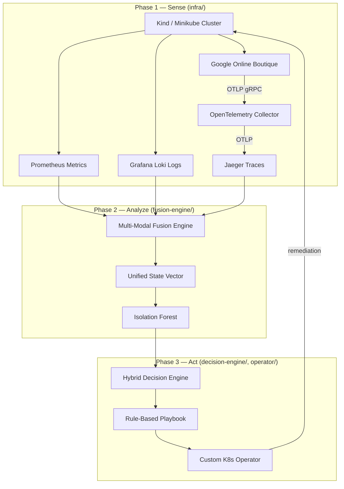

# Architecture

Intelligent Self-Healing Framework — Sense → Analyze → Act control loop.

## High-Level Flow



## Phase 1 — Sense (Implemented)

Phase 1 establishes an isolated Kubernetes testbed with three telemetry pillars (metrics, logs, traces) under fault-free baseline conditions. This aligns with thesis sections 3.2 (research environment) and 3.3.1 (observability instrumentation).

### Deployment Order

```bash
# Full Phase 1 (Kind cluster + observability + boutique)
bash infra/scripts/deploy-phase1.sh kind

# Or on existing cluster
bash infra/scripts/deploy-phase1.sh skip-cluster

# Verify health
bash infra/scripts/verify-stack.sh

# Collect 30-minute fault-free baseline
bash infra/scripts/collect-baseline.sh
```

### Cluster

| Setting | Value |
|---------|-------|
| Providers | Kind (default) or Minikube |
| Cluster name | `self-healing-research` |
| Kubernetes version | `1.31.4` |
| Kind version | `v0.27.0` |
| Minikube version | `v1.35.0` |
| Worker nodes (Kind) | 2 workers + 1 control-plane |
| Minikube resources | 4 CPU, 8 GB RAM, 40 GB disk |

**Namespaces:** `boutique`, `observability`, `chaos-mesh` (reserved for Phase 4)

**Config files:**
- `infra/cluster/kind-config.yaml` — port mappings for UIs (9090, 3000, 16686, 3100)
- `infra/cluster/namespaces.yaml`
- `infra/cluster/setup-kind.sh`, `setup-minikube.sh`, `destroy.sh`

### Workload — Google Online Boutique

| Setting | Value |
|---------|-------|
| Version | `v0.10.6` |
| Namespace | `boutique` |
| Source | `GoogleCloudPlatform/microservices-demo` (kustomize remote base) |
| Traffic | Built-in `loadgenerator` deployment |

**OpenTelemetry instrumentation:** All trace-enabled services send OTLP gRPC to `opentelemetry-collector.observability.svc.cluster.local:4317` with `ENABLE_TRACING=1`.

**Prometheus metrics:** Cluster-level metrics via kube-prometheus-stack (cAdvisor, kube-state-metrics, node-exporter). Application RED metrics are derived from OTLP traces by the OTEL collector spanmetrics connector and scraped from `opentelemetry-collector:8889`.

**Config files:**
- `infra/boutique/kustomization.yaml`
- `infra/boutique/patches/otel-tracing.yaml`

### Observability Stack

All components deploy to namespace `observability` via Helm.

#### Prometheus (metrics)

| Setting | Value |
|---------|-------|
| Helm chart | `kube-prometheus-stack` |
| Chart version | `88.3.0` |
| Retention | 7 days |
| Scrape interval | 15s |
| Grafana admin password | `research` (change for production) |
| Grafana NodePort | `30300` |

Scrapes cluster metrics (node-exporter, kube-state-metrics, cAdvisor) plus OTEL-derived boutique span metrics from the collector Prometheus exporter.

**Values:** `infra/observability/values/kube-prometheus-stack.yaml`

#### Grafana Loki (logs)

| Setting | Value |
|---------|-------|
| Helm chart | `loki` |
| Chart version | `6.30.1` |
| Mode | SingleBinary |
| Retention | 168h (7 days) |
| Storage | filesystem (local dev) |
| Gateway NodePort | `31000` |

**Values:** `infra/observability/values/loki.yaml`

#### Promtail (log shipper)

| Setting | Value |
|---------|-------|
| Helm chart | `promtail` |
| Chart version | `6.17.0` |
| Push endpoint | `http://loki-gateway.observability.svc.cluster.local/loki/api/v1/push` |

DaemonSet on all nodes; labels: `namespace`, `pod`, `container`.

**Values:** `infra/observability/values/promtail.yaml`

#### Jaeger (traces)

| Setting | Value |
|---------|-------|
| Helm chart | `jaeger` |
| Chart version | `3.4.1` |
| Image | `jaegertracing/all-in-one:1.64.0` |
| Storage | in-memory |
| Query UI NodePort | `31686` |

**Values:** `infra/observability/values/jaeger.yaml`

#### OpenTelemetry Collector

| Setting | Value |
|---------|-------|
| Helm chart | `opentelemetry-collector` |
| Chart version | `0.127.2` |
| Image | `otel/opentelemetry-collector-contrib:0.127.0` |
| Receivers | OTLP gRPC `:4317`, HTTP `:4318` |
| Exporter | OTLP → `jaeger-collector.observability.svc.cluster.local:4317` |

**Values:** `infra/observability/values/otel-collector.yaml`

### Telemetry Data Flow

```
Boutique pods ──OTLP gRPC:4317──► OTEL Collector ──OTLP──► Jaeger
Node pods ──stdout──► Promtail ──push──► Loki
Boutique + cluster ──scrape──► Prometheus
Grafana ──queries──► Prometheus, Loki, Jaeger (datasources pre-provisioned)
```

### Baseline Collection

| Setting | Value |
|---------|-------|
| Duration | 12000s (200 min) for a trainable run — see `MIN_TRAINABLE_SAMPLES` note below; 1800s (30 min) is quality-gate-complete but NOT trainable; smoke: `BASELINE_DURATION_SECONDS=180` |
| Sample interval | 60s |
| Min trainable samples | 200 (`MIN_TRAINABLE_SAMPLES` in `infra/versions.env`) — a 30-sample (1800s) run was empirically found too small for Isolation Forest to separate a 30σ outlier from baseline |
| Output | `evaluation/runs/baseline/<run-id>/` |
| Script | `infra/scripts/collect-baseline.sh` |
| Quality gate | `infra/scripts/check-baseline-quality.sh` |
| Protocol | `docs/measurement-protocol.md` |

Each run captures:
- **metrics/** — named PromQL: RED request/error/duration, frontend success rate, CPU, memory, pod phase
- **logs/** — Loki range queries for `{namespace="boutique"}` only
- **traces/** — Jaeger services list + frontend traces
- **meta/** — run manifest, `quality.json`, pod state, resource usage

Promtail drops the `observability` namespace so Loki self-logs cannot enter RQ1 log features.
Loki image is pinned to `3.5.1` to silence the 3.5.0 `push.go` structured-metadata error spam.

### Local Access (Kind port mappings)

| Service | URL |
|---------|-----|
| Prometheus | http://localhost:9090 |
| Grafana | http://localhost:3000 (admin / research) |
| Jaeger | http://localhost:16686 |
| Loki gateway | http://localhost:3100 |
| Boutique frontend | `kubectl port-forward -n boutique svc/frontend-external 8080:80` |

### Version Pin Source

All versions are centralized in `infra/versions.env`.

---

## Phase 2 — Analyze (Planned)

| Component | Directory | Responsibility |
|-----------|-----------|----------------|
| Fusion Engine | `fusion-engine/` | Ingest, normalize, time-align telemetry → State Vector |
| Isolation Forest | `fusion-engine/` | Unsupervised anomaly detection on fault-free baseline |

## Phase 3 — Act (Planned)

| Component | Directory | Responsibility |
|-----------|-----------|----------------|
| Decision Engine | `decision-engine/` | Anomaly signal → rule match → action |
| Operator | `operator/` | Execute remediation via Kubernetes API |

## Phase 4 — Validate (Planned)

| Component | Directory | Responsibility |
|-----------|-----------|----------------|
| Chaos Mesh | `infra/chaos-mesh/`, `evaluation/scenarios/` | 12 failure scenarios |
| Analysis | `evaluation/analysis/` | Run A vs Run B statistical comparison |

## Experimental Conditions

- **Run A:** Baseline native Kubernetes recovery (framework disabled)
- **Run B:** Framework-enabled autonomous recovery

## Key Metrics

- MTTD — Mean Time To Detect
- MTTR — Mean Time To Recovery
- Precision, Recall, F1 — Anomaly detection accuracy
- Availability — Service uptime during fault window
